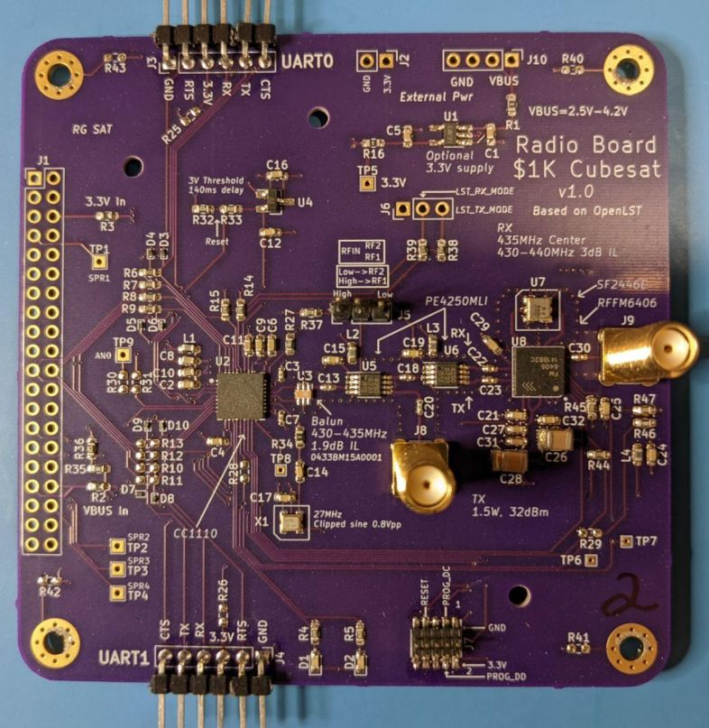
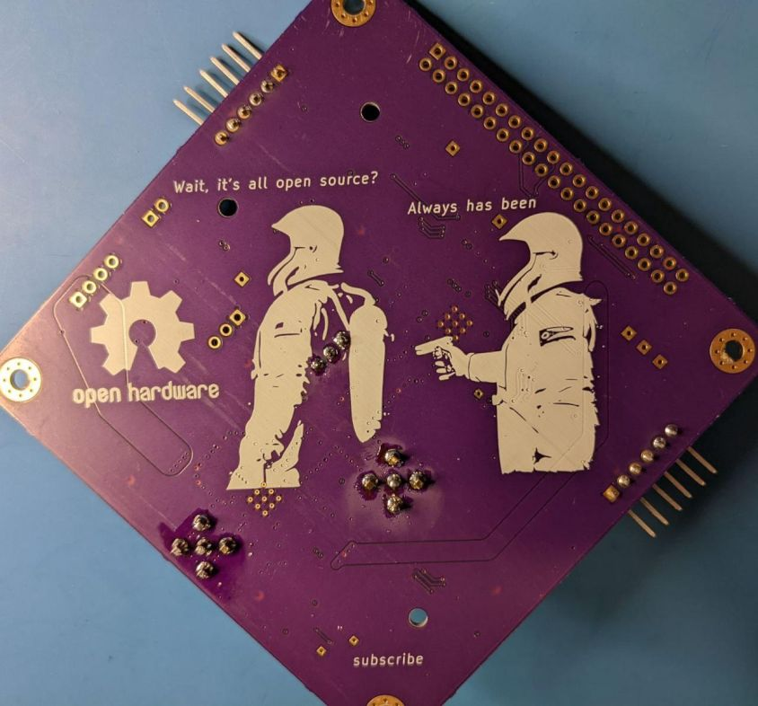

$1K CubeSat Design
==========================

This forked repo adapts the hardware from the OpenLST Reference into something that works for my $1K CubeSat project

**Please note that this repository is desgined to be used as a submodule**, since it depends on symbols & footprints in my [1KCubeSat_Hardware repository](https://github.com/rgw3d/1KCubeSat_Hardware)

Overview
--------

This is an iteration on the OpenLST CC1110 based design, which itself is a simplified version of the TI CC1110 432 MHz reference design.
While the CC1110 can operate over 400-470MHz, this board is designed to operate around 435MHz, within the 435MHz-438MHz US Amateur radio band.
See the [FCC's chart, specifically section 5.282](https://transition.fcc.gov/oet/spectrum/table/fcctable.pdf)

* [Schematic](pdf/openlst-hw.pdf) in PDF form
* [Bill of materials](bom/) with ordering information & datasheet links
* [Gerber files](gerber/osh_park) for PCB fabrication

RF Pipeline
-----------

* **0433BM15A0001 Balun**. Designed for 430-435MHz, but should work up to 437MHz. Single part, designed specifically for the CC1110. I did not want to design my own balun.
* **PE4250MLI RF Switch**. Generic SPDT RF Switch. First RF switch breaks out to a test port. Second RF switch switches between TX & RX paths on the RF Frontend (RFFM6403).
* **RFFM6403 Analog Frontend**. TX path with 1.5W PA, RX path with LNA & SAW filter. Designed to work over the 408-455MHz band.
* **SF2446E SAW Filter**. Part of the Analog Frontend RX path. 430-440MHz band pass.
* 50 Ohm
* Impedance calculations for OSH Park PCB found [here](images/osh-park-4-layer-50ohms.png)

Design Verification
--------

Initial testing has verified basic functionality.

* 437MHz reference software from the [OpenLST Software repo](https://github.com/rgw3d/openlst) is able to be flashed onto the CC1110. NOTE: CC1110 PA output power was modified from 10dBm to 0dBm.
* The 3.3V rail consumes 130mA to 150mA. One board indicated 130mA, another one had 150mA, unsure what causes the discrepency.
* The 27MHz clipped sine wave oscillator works as a clock source
* The RF pipeline is functional. Both the test output (J8) and the RF Frontend output (J9) function.
* Radio-to-radio communication with test outputs connected. Communication was initiated using UART1 on Board 1.
  * (J8, Board 1)---(coax)---(30dBm attenuator)---(coax)---(J8, Board 2)
* Radio-to-radio communication with RF Frontend outputs connected. Communication was initiated using UART1 on Board 1.
  * (J9, Board 1)---(coax)---(three 30dBm attenuators)---(coax)---(J9, Board 2)
* At this time no RF performance characteristics were measured. (I don't have the lab equipment for those tests)

Improvements for future version
--------

* Pi network at output of RF Frontend. Could be useful to match an antenna.
* Better 3.3V LDO. For a bench top setup, U1 (ADP150-3.3V) can just supply 150mA. While this design assumes an external 3.3V source, this on-board convenience ought to be sized up.
* Ferrite beads or 0Ohm Resistors on power inputs to all components. During assembly for one of the boards, a short was detected on the 3.3V rail. Several components share that rail without an easy way to open it, which would have made isolating the problem simple.

Pictures
--------

Original README below

OpenLST Reference Hardware
==========================

This repository contains a KiCad project with a hardware reference
implementation for the OpenLST.  This design is a simplified version
of the Texas Instruments CC1110 432 MHz reference design.  A 1 watt
power amplifier module has been added to increase operating range.
The design is intended for use at 437 MHz, however, it may be modified
for use at other frequencies.

The user is responsible for obtaining and maintaining the necessary
license to operate this radio.  The example project uses frequencies
in the US Amateur Radio UHF band. Transmissions in this band require a
valid FCC license and compliance with CFR Part 97.

License & Legal Information
---------------------------

Copyright 2018 Planet Labs Inc. This work is licensed under a
Creative Commons Attribution-ShareAlike 4.0 International License.

This document may contain technology or software the export of which
is or may be restricted by the Export Administration Act and the
Export Administration Regulations (EAR), 15 C.F.R. parts
730-774. Diversion contrary to U.S. law is prohibited.
